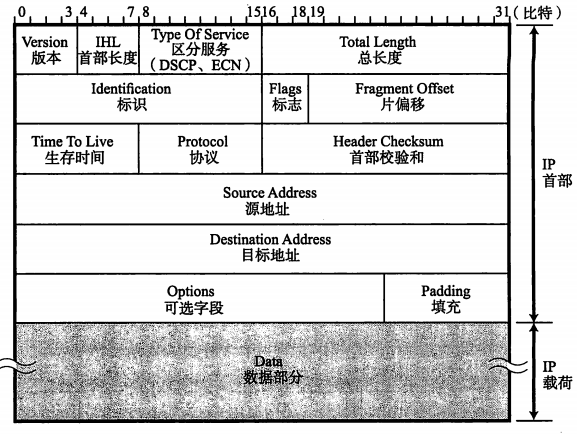
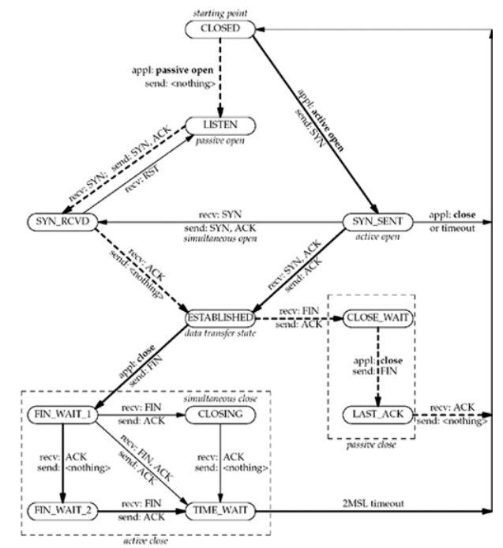

# 计算机网络知识概述
## 网络参考模型
### OSI参考模型
> OSI参考模型将网络通信协议中的必要功能分成了7层，每一层遵循自己的协议，实现相关的功能  
> 模型中上下层之间进行交互遵循的约定叫“接口”，同层之间进行交互遵循的约定叫“协议”  
> 模型从下到上依次为：物理层，数据链路层，网络层，传输层，会话层，表示层，应用层
-  物理层：实现物理传输过程中比特流和电子信号的转换，界定连接器和网线的规格
-  数据链路层：数据帧生成以及互连设备之间数据帧的传送
-  网络层：IP数据包的生成，地址管理，路由选择
-  传输层：TCP数据报文的生产，管理两个节点之间的数据可靠传输，确保数据被可靠地传递到目的地址
-  会话层：通信管理，负责建立和断开通信连接；管理传输层以下的分层
-  表示层：设备固有数据格式和网络标准数据格式的转换
-  应用层：为应用程序提供服务，针对特定应用程序的协议
### TCP/IP协议分层模型
> TCP/IP协议成为网际协议族包含应用协议（HTTP,SMTP,FTP,TELNET,SNMP），传输协(TCP,UDP),网际协议（IP,ARP,ICMP),路由控制协议（RIP,OSPF,BGP)   
> TCP基础OSI模型，统一了OSI模型的上三层，对应下四层协议，生成了自己的TCP/IP协议四层模型，
从下往上依次为硬件（物理层），网络接口层，互联网层，传输层，应用层
- 硬件（物理层）：负责数据传输的硬件，相当于以太网和电话线等物理层设备
- 网络接口层：利用以太网中的数据链路层进行通信，是网络传输的最小单元。该层定义了通信传媒互连的设备之间传输的规范。该层传输的数据为数据帧
（在IP数据包上添加MAC）首部，利用MAC地址寻址，进行互连的统一数据链路的节点之间的通信连接。传输的数据链路有以太网，无线局域网等。
接口的含义可以理解为NIC网卡驱动程序。
- 互联网层：跨越多种数据链路，在不同的数据链路上，通过路由选择控制，实现两端节点之间的IP数据包传输。
- 传输层：功能和OSI模型的传输层功能基本一致。
- 应用层：将OSI模型中会话层，表示层，应用层的功能都集中在到了应用程序中。常见的应用层协议有HTTP-WWW，SMTP-EMAIL，FTP-文件传输，TELNET/SSH（远程登录）
，SNMP(网络管理）。
### TCP/IP和OSI参考模型对应理解图

## 部分网络设备和部分网络协议概述
### 网络中部分设备概述
- 网卡：计算机设备连接网络所需要的配置，如网络配置器等。
- 中继器：物理层上扩大网络的设备，可以将电缆的信号放大一倍传给另一个电缆。
- 网桥/2层交换机：数据链路层上连接两个网络的设备，识别数据帧的内容并转发给相邻网段，根据MAC地址进行处理。
- 路由器/3层交换机：网络层连接两个网络并对分组报文进行转发，根据IP地址进行处理。
- 4-7层交换机：传输层到应用层，以TCP等协议分析收发数据，负载均衡器就是其中一种。
- 网关：数据进行转换和转发的工具，可用于传输层到应用层之间数据的转化和转发。如代理服务器proxy就是应用网关的一种。
- 防火墙：因特网与计算机用户之间的安全软件。具有识别和筛选能力，可以把未被授权或具有潜在破坏性的访问阻挡在外。
### 网络中部分协议概述
- IP：网际协议，网际协议族的主力协议（IPV4/IPV6），为TCP/UPD/STCP/TCMP提供分组递送服务。
- TCP：传输控制协议（Transmission Control Protocol），面向连接的协议，为用户进程提供可靠的全双工字节流。
- UPD：用户数据报协议（User Datagram Protocol）,无连接的协议。
- ARP：地址解析协议，根据IP地址，得到MAC地址。
- RARP：反向地址解析协议，根据MAC地址，得到IP地址。
- ICMP：网际控制消息协议，处理在路由器和主机之间流通的错误和控制消息。

## TCP-IP数据包结构
### 网络分层模型中的数据包结构图

### TCP数据报首部结构

1.  源端口号，目的端口号：源端口号一般为传输层协议自动生成，目的端口号标识了务器不同的服务类型。
2.  序列号：发送数据的位置，数据由建立连接时计算机生成的随机数作为其初始值。
3.  确认号：下一次应该收到的数据的序列号，标识已经收到确认应答号数据减一的数据。
4.  数据偏移量：TCP包的数据部分从包的哪个位置开始算起。
5.  保留：用于以后扩展使用。
6.  控制位：标识包的一些作用，有ACK,SYN,FIN,RST,PSH,URG,ECE,CWR8种控制位。
7.  窗口大小：从TCP首部确认应答号开始能接受的数据大小。
8.  校验和：用于确保收到的数据是正确的
7.  紧急指针：表示本报文中紧急数据的指针
8.  选项：提高TCP的传输性能，包含最大分片大小（MSS）,窗口扩大,时间戳等

### IPV4数据报首部结构

1. 版本：标识IP首部的版本号
2. 首部长度：首部的长度，单位为4字节，一般设置20字节
3.  区分服务(TOS)：表明服务质量，如ECN字段用来表示拥塞状况
4.  总长度：IP首部和数据的总长度，最长为65535字节
5.  标识：用于分组重组，同一分片的标识值相同，不同分片的标识值不同
6.  标志：用于标志IP数据包能否分片，分片的话是否为最后一个分片
7.  偏移量：标识被分片的每一个分段相对于原始数据的位置
8.  生存时间：数据包在网络上能生存的时间
9.  协议：IP首部的下一个首部属于哪一个协议
10.  首部校验和：校验数据报的首部，确保IP数据包不被损坏
11.  源地址，目的地址：发送和接收方的IP地址，32比特
12.  可选项：包含安全级别，源路径，路径记录，时间戳，用于试验和诊断
13.  填充：确保数据首部为32比特的整数倍

## TCP连接建立终止、数据传递、状态分析
### 三次握手——TCP连接的建立

>1. 服务器被动打开，监听端口，等待接收客户端连接请求
>2. 客户端主动打开，发起连接请求，发送SYN包给服务器（包含客户端将在连接中发送数据的初始序列号）
>3. 服务器确认收到客户端的SYN包，发送ACK确认，同时发送自己的SYN包给客户端（包含服务器将在连接中发送数据的初始序列号）
>4. 客户端确认收到服务器的SYN包，发送ACK确认包。
### TCP数据传送
>TCP提供面向连接的可靠传输，具体表现在以下机制：
>1. 在数据传输之前，就建立连接管理。
>2. 通过序列号和确认应答号提高可靠性。
>3. 流量控制，TCP会告知对端目前窗口大小。
>4. 超时重传，超过一定时间没有收到ACK确认应答，重传数据包。
>5. 拥塞控制，使用慢启动算法动态调整发送数据量
### 四次挥手——TCP连接的断开

>1. 应用程序主动关闭，发送FIN包
>2. 服务器收到FIN包，执行被动关闭，接收作为文件结束符传递给接收端应用进程（进入排队等待）。发送ACK确认包给对端
>3. 进程接收到文件结束符，执行关闭操作，发送FIN包为客户端
>4. 接收到FIN包，发送确认ACK包
### TCP状态转移分析
>TCP在连接建立和断开过程中，共有11种不同的状态。如下图所示：  
>
>1. 从CLOSED状态，可以通过被动开始进入LISTEN状态,通过主动连接发送SYN包进入SYN_SENT状态；LISTEN接收到SYN包,并发送ACK,SYN进入SYN_RCVD状态。 
>2. SYN_SENT状态接收到了ACK,SYN,发送ACK可以进入ESTABLISHED状态,SYN状态关闭或者超时收到ACK进入CLOSED状态；
SYN_RCVD收到ACK进入ESTABLISHED状态,SYN_RCVD收到RST包进入LISTEN状态。
>3. ESTABLISH状态下，主动关闭发动FIN状态，进入FIN_WAIT1状态；被动接收到FIN包并发送ACK进入CLOSE_WAIT状态
>4. FIN_WAIT1状态仅收到ACK包进入FIN_WAIT2状态，再接收到FIN发送ACK进入TIME_WAIT状态；
收到ACK,FIN,发送ACK直接进入TIME_WAIT状态；
先收到FIN,发送ACK进入CLOSING状态，再接收到ACK进入TIME_WAIT状态。
TIME_WAIT经过2倍MSL（Maximum segment lifetime）进入CLOSED状态。
>5. CLOSE_WAIT状态下主动发送FIN包进入LAST_ACK状态，收到ACK包，进入CLOSED状态。

